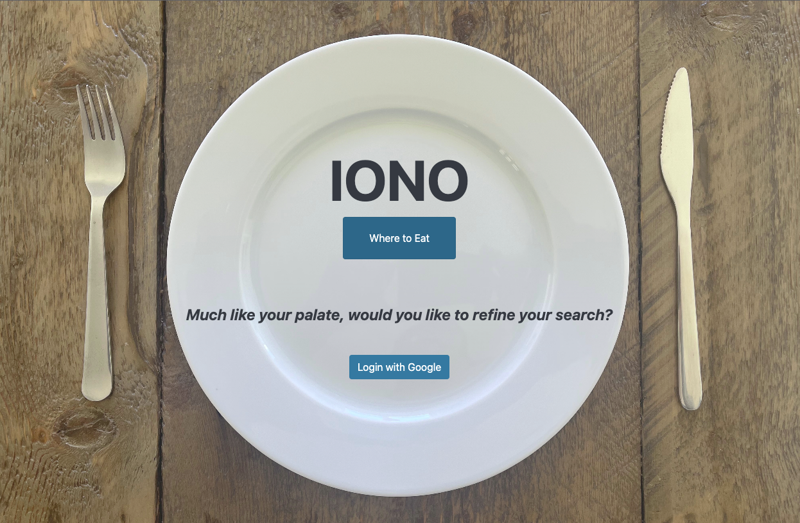
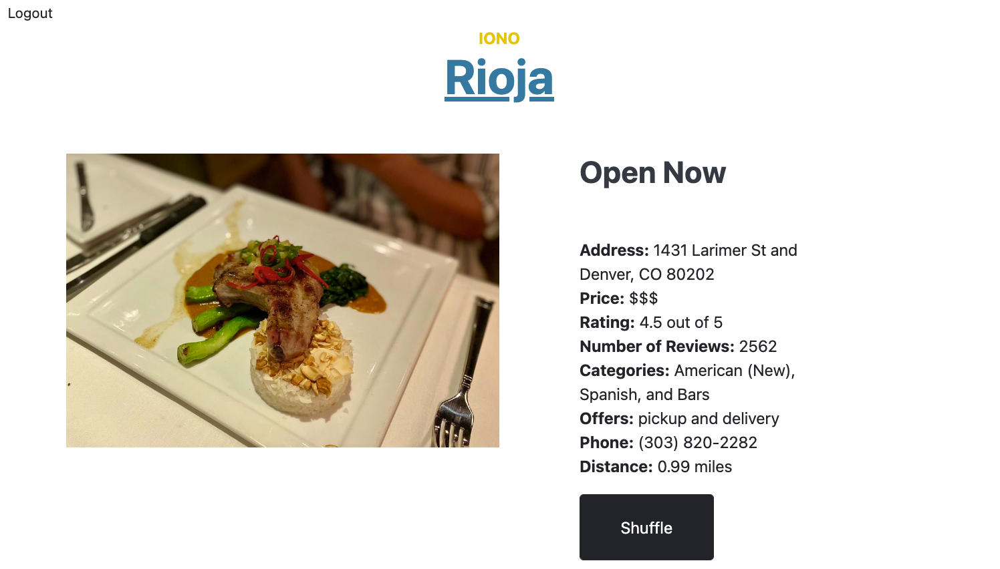

<!-- Improved compatibility of back to top link: See: https://github.com/othneildrew/Best-README-Template/pull/73 -->
<a name="readme-top"></a>
<!--
*** Thanks for checking out the Best-README-Template. If you have a suggestion
*** that would make this better, please fork the repo and create a pull request
*** or simply open an issue with the tag "enhancement".
*** Don't forget to give the project a star!
*** Thanks again! Now go create something AMAZING! :D
-->


<!-- PROJECT SHIELDS -->
<!--
*** I'm using markdown "reference style" links for readability.
*** Reference links are enclosed in brackets [ ] instead of parentheses ( ).
*** See the bottom of this document for the declaration of the reference variables
*** for contributors-url, forks-url, etc. This is an optional, concise syntax you may use.
*** https://www.markdownguide.org/basic-syntax/#reference-style-links
-->
[![Contributors][contributors-shield]][contributors-url]
[![Issues][issues-shield]][issues-url]
<!-- [![LinkedIn][linkedin-shield]][linkedin-url] -->
<!-- [![Forks][forks-shield]][forks-url] -->
<!-- [![Stargazers][stars-shield]][stars-url] -->
<!-- [![MIT License][license-shield]][license-url] -->


<!-- PROJECT LOGO -->
<!-- <br /> -->
<!-- <div align="center">
  <a href="https://github.com/github_username/repo_name">
    
  </a> -->

<h3 align="center">IONO (Where to Eat)</h3>

  <p align="center">
    Have you found yourself in a state of IONO ("I don't know") where to eat tonight? Let the IONO app help out with that! This app was designed to provide visitors with a restaurant to solve their culinary woes, based on their location, and filters available to authenticated users.
    <br />
    <a href="https://github.com/IONO-where-to-eat/iono_fe"><strong>Explore the docs »</strong></a>
    <br />
    <br />
    <a href="https://github.com/IONO-where-to-eat/iono_fe">View Demo</a>
    ·
    <a href="https://github.com/IONO-where-to-eat/iono_fe/issues">Report Bug</a>
    ·
    <a href="https://github.com/IONO-where-to-eat/iono_fe/issues">Request Feature</a>
  </p>
</div>


<!-- TABLE OF CONTENTS -->
<details>
  <summary>Table of Contents</summary>
  <ol>
    <li>
      <a href="#about-the-project">About The Project</a>
      <ul>
        <li><a href="#built-with">Built With</a></li>
      </ul>
    </li>
    <li>
      <a href="#getting-started">Getting Started</a>
      <ul>
        <li><a href="#prerequisites">Prerequisites</a></li>
        <li><a href="#installation">Installation</a></li>
      </ul>
    </li>
    <li><a href="#usage">Usage</a></li>
    <li><a href="#highlights">Highlights</a></li>
    <li><a href="#learning-goals">Learning Goals</a></li>
    <li><a href="#known-issues">Known Issues</a></li>
    <li><a href="#future-goals">Future Goals</a></li>
    <li><a href="#contact">Contact</a></li>
    <li><a href="#acknowledgments">Acknowledgments</a></li>
  </ol>
</details>


<!-- ABOUT THE PROJECT -->
## About The Project

[![Product Name Screen Shot][product-screenshot]](https://example.com)


### Built With

<!-- * [![Next][Next.js]][Next-url]
* [![React][React.js]][React-url]
* [![Vue][Vue.js]][Vue-url]
* [![Angular][Angular.io]][Angular-url]
* [![Svelte][Svelte.dev]][Svelte-url]
* [![Laravel][Laravel.com]][Laravel-url] -->
* [![Rails][Rails.org]][Rails-url]
* [![Bootstrap][Bootstrap.com]][Bootstrap-url]
<!-- * [![JQuery][JQuery.com]][JQuery-url] -->

<p align="right">(<a href="#readme-top">back to top</a>)</p>


<!-- GETTING STARTED -->
## Getting Started
## (for Mac)

<!-- 1. Start by following the instructions for the backend repo for this project found in the Readme here: https://github.com/IONO-where-to-eat/iono_be -->
<!-- This is an example of how you may give instructions on setting up your project locally.
To get a local copy up and running follow these simple example steps. -->

### Prerequisites
- Ruby Version 2.7.4
- Rails Version 5.2.7
- Bootstrap Version 4.6.2

### Gems Utilized for Testing and Development
- RSpec 
- Pry
- SimpleCov
- Shoulda-Matchers 
- Factory_Bot_Rails
- Faker
- jsonapi-serialize
- Webmock
- VCR

### Globally Utilized Gems
- Omniauth-google-oauth2
- Figaro
- Bootsnap
- JQuery-rails

### Installation

1. Create a parent directory for the IONO frontend and backend applications. Both repositories will live in this directory. On your local machine open a terminal session and enter the following command:

```sh
$ mkdir IONO
```
- Navigate into this directory using the `$cd` command.
```sh
$ cd IONO
```

2. Clone this repository:<br>
Enter the following commands for SSH or HTTPS to clone the frontend application repository.

- using ssh key <br>
```sh
$ git clone git@github.com:IONO-where-to-eat/iono_fe.git
```
- using https <br>
```shell
$ git clone https://github.com/IONO-where-to-eat/iono_fe
```

- Once cloned, you'll have a new local copy in the directory you ran the clone command in. Navigate into the frontend directory using the `$cd` command.

```sh
$ cd iono_fe
```

3. Install required gems: <br>
In terminal, use Bundler to install any missing Gems. If Bundler is not installed, first run the following command.

```shell
$ gem install bundler
```

- If Bundler is already installed or after it has been installed, run the following command.

```shell
$ bundle install
```

```shell
$ bundle exec figaro install
```

4. You will now need to navigate to the parent directory and set up the backend application. 

```sh
$ cd ..
```

5. Clone the backend repository:<br>
Enter the following commands for SSH or HTTPS to clone the frontend application repository.

- using ssh key <br>
```sh
$ git clone git@github.com:IONO-where-to-eat/iono_be.git
```
- using https <br>
```shell
$ git clone https://github.com/IONO-where-to-eat/iono_be
```

- Navigate into the backend directory:

```sh
$ cd iono_be
```

6. Install required gems: <br>

```shell
$ bundle install
```

```shell
$ bundle exec figaro install
```
 ### ***The following steps apply to both frontend and backend*** 
 <br>

7. Database Migration<br>
Before using the web application you will need to setup your databases locally by running the following commands:

```shell
$ /iono_fe main $ rails db:{drop,create,migrate}
```

```shell
$ /iono_be main $ rails db:{drop,create,migrate}
```

8. Startup and Access<br>
Finally, in order to use the web app you will have to start servers locally and access the app through a web browser. 
- Start servers

```shell
$ /iono_fe main $ rails s
```
```shell
$ /iono_be main $ rails s
```

<p align="right">(<a href="#readme-top">back to top</a>)</p>


<!-- USAGE EXAMPLES -->
## Usage

Visit site [IONO](https://iono-where-to-eat.herokuapp.com/) or on [local](http://localhost:3000)

Click 'Where to Eat'



View the randomized restaurant selection


Click Shuffle

View the next restaurant in the randomized list


Click Home link

Click Login with Google

Fill in filters as desired

Click Find Me Food


View the randomized restaurant selection



Click Shuffle

View the next restaurant in the randomized list


Click Logout link


<p align="right">(<a href="#readme-top">back to top</a>)</p>


<!-- HIGHLIGHTS -->
## Highlights

- Google OAuth2: For authenticated access, IONO implements Google OAuth2 using the OmniAuth gem. From the homepage, users are prompted to login using Google and routed to a screen where they allow Google to share user   information and provide an authenticity token to use for the session. The OmniAuth gem also supports testing with features that allow IONO to mock Google account info for complete feature test coverage.

<p align="right">(<a href="#readme-top">back to top</a>)</p>


<!-- LEARNING GOALS -->
## Learning Goals

- The goal of this project is to create a successful web application from a student-led project idea. The team will create an app that will solve a real world problem, and allow users to authenticate with a third-party service, and consume at least two other apis.

<p align="right">(<a href="#readme-top">back to top</a>)</p>

<!-- KNOWN ISSUES -->
## Known Issues

- When deploying to production using Heroku, it was discovered that Heroku adds a "X-Path-Header" to the API request which alters the IP address when using the app. The results for both visitors and registered users default to a Virginia zip code and do not reflect the users actual longitude and latitude. After much research and consideration, it was decided to keep the app deployed on Heroku as is due to the unknown, looming changes to Heroku accounts. All features have been tested on a local server and operating as expected. 

<p align="right">(<a href="#readme-top">back to top</a>)</p>

<!-- FUTURE GOALS -->
## Future Goals


See the [open issues](https://github.com/IONO-where-to-eat/iono_fe/issues) for a full list of proposed features (and known issues).
<p align="right">(<a href="#readme-top">back to top</a>)</p>

<!-- CONTACT -->
## Contact

- Benjamin Randoloph - [@neb417](https://github.com/neb417)
- Rebecka Hendricks - [@rebeckahendricks](https://github.com/rebeckahendricks)
- Taryn Orlemann - [@torlemann](https://github.com/torlemann)
- Thomas Hayes - [@thayes87](https://github.com/thayes87)

Project Link: [https://github.com/IONO-where-to-eat](https://github.com/IONO-where-to-eat)


<!-- ACKNOWLEDGMENTS -->
## Acknowledgments

- Project Manager - [@megstang](https://github.com/megstang)

<p align="right">(<a href="#readme-top">back to top</a>)</p>


<!-- MARKDOWN LINKS & IMAGES -->
<!-- https://www.markdownguide.org/basic-syntax/#reference-style-links -->
[contributors-shield]: https://img.shields.io/github/contributors/github_username/repo_name.svg?style=for-the-badge
[contributors-url]: https://github.com/IONO-where-to-eat/iono_fe/graphs/contributors
[forks-shield]: https://img.shields.io/github/forks/github_username/repo_name.svg?style=for-the-badge
[forks-url]: https://github.com/github_username/repo_name/network/members
[stars-shield]: https://img.shields.io/github/stars/github_username/repo_name.svg?style=for-the-badge
[stars-url]: https://github.com/github_username/repo_name/stargazers
[issues-shield]: https://img.shields.io/github/issues/github_username/repo_name.svg?style=for-the-badge
[issues-url]: https://github.com/IONO-where-to-eat/iono_fe/issues
[license-shield]: https://img.shields.io/github/license/github_username/repo_name.svg?style=for-the-badge
[license-url]: https://github.com/github_username/repo_name/blob/master/LICENSE.txt
[linkedin-shield]: https://img.shields.io/badge/-LinkedIn-black.svg?style=for-the-badge&logo=linkedin&colorB=555
[linkedin-url]: https://linkedin.com/in/linkedin_username
[product-screenshot]: images/screenshot.png
[Next.js]: https://img.shields.io/badge/next.js-000000?style=for-the-badge&logo=nextdotjs&logoColor=white
[Next-url]: https://nextjs.org/
[React.js]: https://img.shields.io/badge/React-20232A?style=for-the-badge&logo=react&logoColor=61DAFB
[React-url]: https://reactjs.org/
[Vue.js]: https://img.shields.io/badge/Vue.js-35495E?style=for-the-badge&logo=vuedotjs&logoColor=4FC08D
[Vue-url]: https://vuejs.org/
[Angular.io]: https://img.shields.io/badge/Angular-DD0031?style=for-the-badge&logo=angular&logoColor=white
[Angular-url]: https://angular.io/
[Svelte.dev]: https://img.shields.io/badge/Svelte-4A4A55?style=for-the-badge&logo=svelte&logoColor=FF3E00
[Svelte-url]: https://svelte.dev/
[Laravel.com]: https://img.shields.io/badge/Laravel-FF2D20?style=for-the-badge&logo=laravel&logoColor=white
[Laravel-url]: https://laravel.com
[Bootstrap.com]: https://img.shields.io/badge/Bootstrap-563D7C?style=for-the-badge&logo=bootstrap&logoColor=white
[Bootstrap-url]: https://getbootstrap.com
[JQuery.com]: https://img.shields.io/badge/jQuery-0769AD?style=for-the-badge&logo=jquery&logoColor=white
[JQuery-url]: https://jquery.com 
[Rails.org]: https://img.shields.io/badge/rails-%23CC0000.svg?style=for-the-badge&logo=ruby-on-rails&logoColor=white
[Rails-url]: https://rubyonrails.org